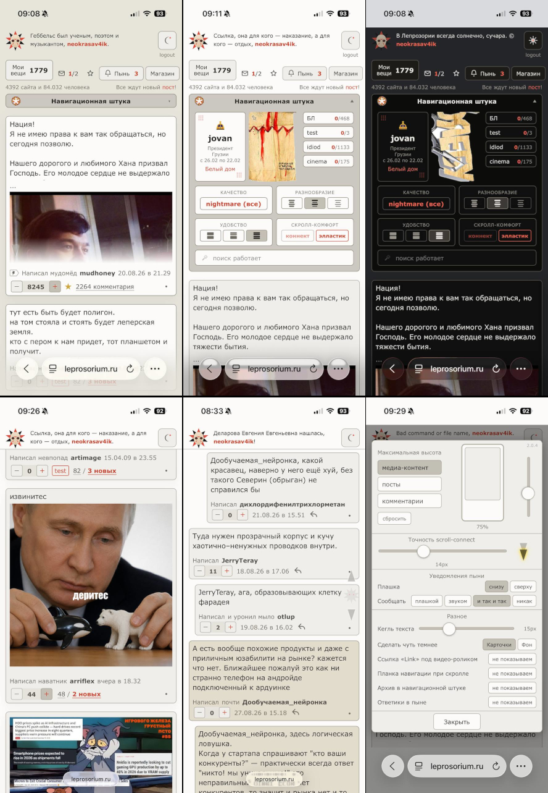

# Lepra Mobile

Пользовательский скрипт, который делает [leprosorium.ru](https://leprosorium.ru) чуть более пригодным для чтения с телефона.

Работает тремя способами: приложением под Андроид, расширением в Safari на
iPhone и расширением в Firefox на Андроиде. Скрипт во всех трёх один и тот же.



## Android — приложение

Самый простой путь: ставится как обычное приложение, ни браузера, ни
менеджера скриптов не нужно. Внутри системный движок WebView и тот же
`lepra-mobile.user.js`.

### Установка

1. Откройте [страницу выпусков](https://github.com/neokrasav4ik/lepra-mobile/releases/latest)
   и скачайте файл `Leprosorium-<версия>.apk`.
2. Откройте скачанный файл. Андроид спросит разрешение ставить приложения из
   этого источника — дайте его; спрашивается один раз.
3. Готово. Приложение называется **Leprosorium**.

Приложение хранит свою сессию отдельно от браузера — войти в лепру придётся
один раз внутри него.

### Обновление

**Приложение обновляется само:** раз в сутки оно спрашивает у GitHub, нет ли
выпуска новее, и предлагает скачать. После загрузки нажмите на уведомление —
Андроид поставит новую версию поверх нынешней, ничего не теряя.

**Скрипт внутри обновляется отдельно и тоже сам:** раз в сутки проверяется
`@updateURL`, и новая версия применяется при следующем запуске приложения.
То есть правки скрипта доезжают до телефона без пересборки приложения.

Проверить обе проверки вручную можно в отчёте (см. ниже).

### Если что-то сломалось

Долгое нажатие по значку приложения → **Диагностика**. Там видно версию
движка, версию скрипта и откуда он взят, заголовки запроса, имена кук и
последние ошибки. Кнопка «Скопировать» кладёт отчёт в буфер — его удобно
приложить к сообщению о поломке.

Там же две кнопки принудительной проверки обновлений и кнопка «Вернуться к
встроенному скрипту» — на случай, если скачанная версия скрипта окажется
негодной.


## iOS Safari

### Установка

1. Поставьте из App Store приложение **Userscripts** (автор Justin Wasack, бесплатное, открытый код).
2. Откройте приложение и выберите папку для скриптов.
3. Настройки → Приложения → Safari → Расширения → Userscripts → включить. Там же для `leprosorium.ru` поставьте «Всегда разрешать».
4. Положите `lepra-mobile.user.js` в выбранную для скриптов папку. Имя обязательно должно оканчиваться на `.user.js`.
5. Откройте Лепру, тапните левый значок в адресной строке → Userscripts → в списке должен появиться Lepra Mobile.

### Обновление

1. Откройте Safari → Меню → Userscripts → Облачко (значок обновлений) → Check Updates → Update


## Android Firefox

Годится, если приложение почему-то не подходит.

### Установка

1. В Firefox откройте меню (три точки) → Extensions (Расширения) → найдите **Tampermonkey** → Add.
2. Firefox → меню (три точки) → Расширения → Tampermonkey → Панель управления (Dashboard) → Вкладка Утилиты (Utilities).
3. Поле Установить с URL (Install from URL) — вставьте туда:
```
https://raw.githubusercontent.com/neokrasav4ik/lepra-mobile/main/lepra-mobile.user.js
```
4. Нажмите Установить. Откроется страница подтверждения со списком того, что скрипт запрашивает, — там же будет кнопка установки.

### Обновление

1. Откройте Firefox → Меню → Расширения → Tampermonkey → Настройки → вкладка "Установленные скрипты" → надпись "Lepra Mobile" → Тап справа от надписи "Обновлён:"


## Персонализация

Для вызова окна настроек скрипта - тапните по центральной области гертруды.


## Что скрипт делает с вашими данными

Ничего не собирает и никуда не передаёт. По сети ходит **только по адресам
самой лепры**. В куки на домене лепры пишет свои настройки и токен для тех же запросов —
без куки настройки на подлепрах расходились бы с настройками на главной. Чужих кук не читает.

Приложение сверх этого ходит на `api.github.com` — за номером последнего
выпуска и за обновлением скрипта.
